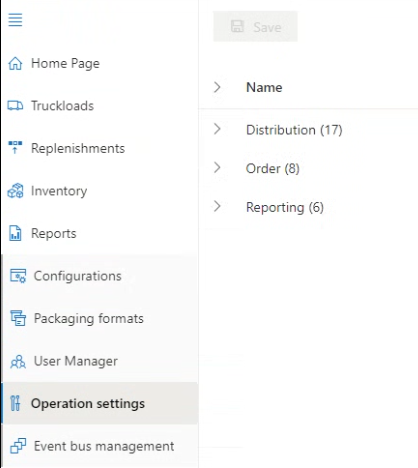

# Operation Settings

**[Home](../index.md) > [Configuration](index.md) > Operation Settings**

## Overview

The **Operation Settings** page contains many key operational parameters and options. They are divided into three categories: **Distribution**, **Order**, and **Reporting**. Each option and parameter has its own description. Certain settings are restricted depending on a user's access level.

**Navigation:** [← User Manager](user-manager.md) | [Event Bus Management →](event-bus.md)
