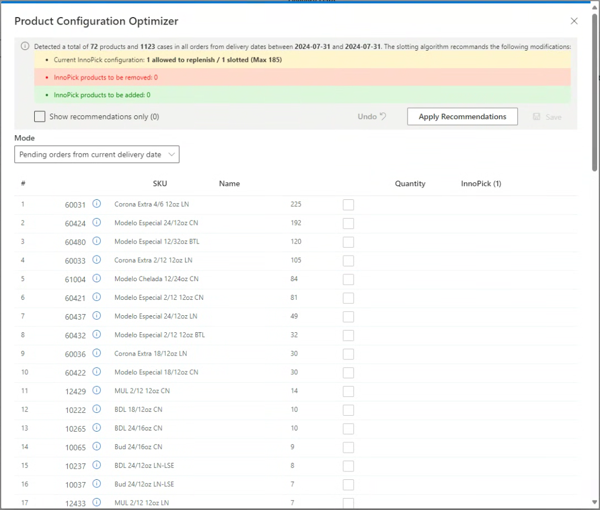
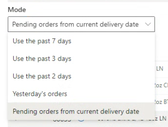

# Product Configuration Optimizer

**[Home](../index.md) > [Configuration](index.md) > Product Configuration Optimizer**

## Overview

The Product Configuration Optimizer is a feature that intelligently analyzes the past or upcoming production statistics to make recommendations on which products should be slotted in InnoPick.

## Optimizer Mode

The **Mode** drop-down menu is where the user can select which production statistics to optimize the system on.

The Optimizer results can help users and production supervisors to improve the efficiency of InnoPick, especially during periods when products are being introduced or removed, or when the volume profile changes significantly.

**Navigation:** [← Packaging Formats](packaging-formats.md) | [User Manager →](user-manager.md)
