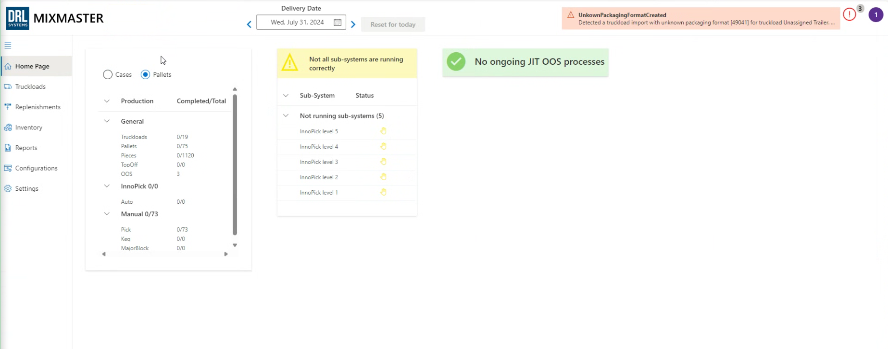

# Home Page

**[Home](../index.md) > Home Page**

## Overview

The Home Page gives the user a high-level summary of the current state of production and various system statuses.

## In This Section

### [Production Summary](production-summary.md)
Total production volume and completion status across sub-systems.

### [Sub-System Status](sub-system-status.md)
Status indicators for each InnoPick level: Faulted, Idle, or Automatic.

### [JIT-OOS Visuals](jit-oos.md)
Just-In-Time Out-Of-Stock information and priority alerts.

**Navigation:** [← Loading MixMaster](../getting-started/loading-mixmaster.md) | [Production Summary →](production-summary.md)
