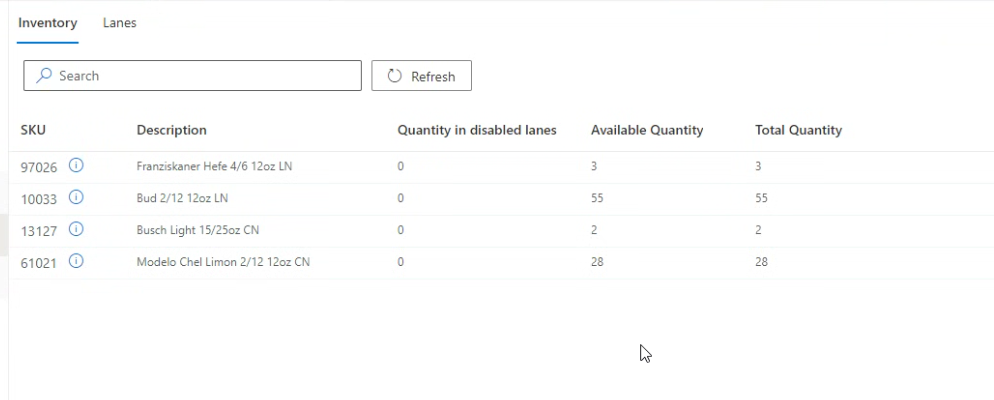
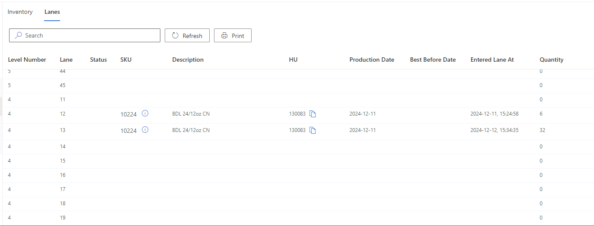

# InnoPick Inventory

**[Home](../index.md) > [Inventory](index.md) > InnoPick Inventory**

## Products View

This page lists all the active products for which there are cases in InnoPick. The **Refresh** button queries InnoPick Manager to get an updated snapshot of the current inventory.

## Lanes View

The Lanes tab lists the same inventory in terms of the specific InnoPick lanes (by level and lane number).

**Navigation:** [← Inventory](index.md) | [Flush →](flush.md)
