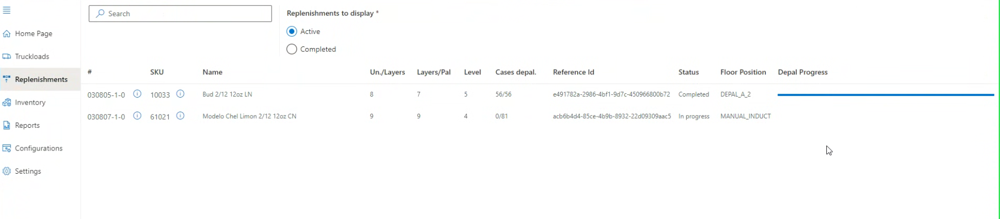
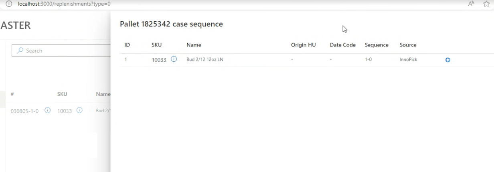
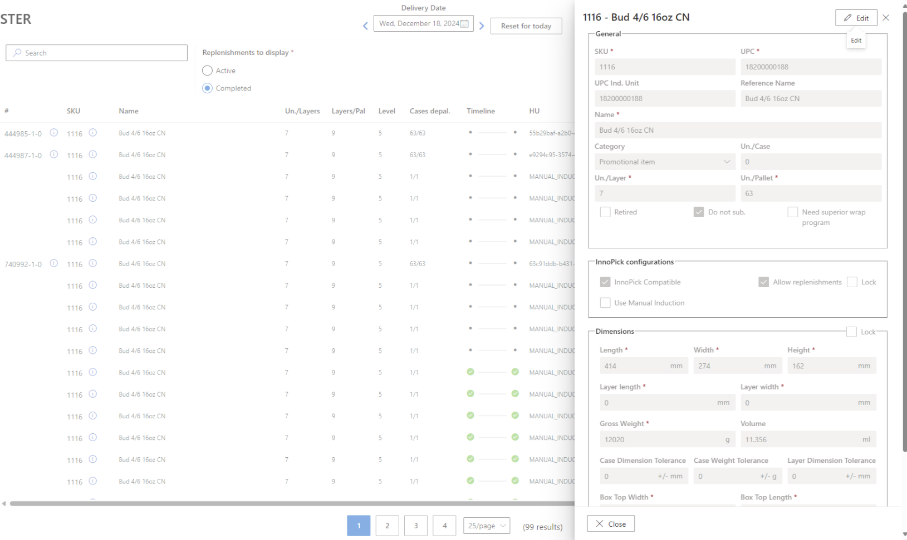

# Replenishments

**[Home](index.md) > Replenishments**

## Overview

The Replenishments page lists all the replenishments that the system has calculated are necessary to complete the production. The page displays **Active** replenishments by default, but the user can select to display **Completed** ones also. Note the various columns that provide important information about each replenishment.

## Viewing Replenishment Details

The user can click on the **#** of the replen (left-most column) and see the case sequence of the pallet whose cases made the replenishment necessary. Replenishments are only created when the system knows it will need a certain product in order to complete a client pallet. The case sequence for the pallet in question is displayed as a pop-up on the right-hand side of the screen without navigating the user away from the replenishments page.

## Viewing Product Details

Users can also click the SKU value and that will open up a similar pop-up with the product details.

**Navigation:** [← Truckload Groupings](truckloads/truckload-groupings.md) | [Inventory →](inventory/index.md)
