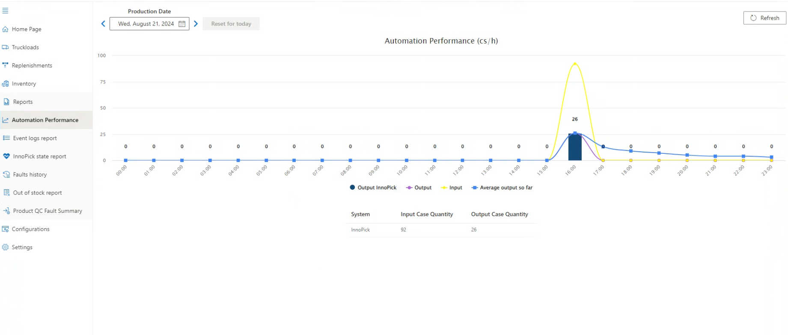

# Automation Performance

**[Home](../index.md) > [Reports](index.md) > Automation Performance**

## Overview

This report is produced for every production date and summarizes various production metrics on a horizontal time scale.

**Navigation:** [← Reports](index.md) | [Event Logs →](event-logs.md)
