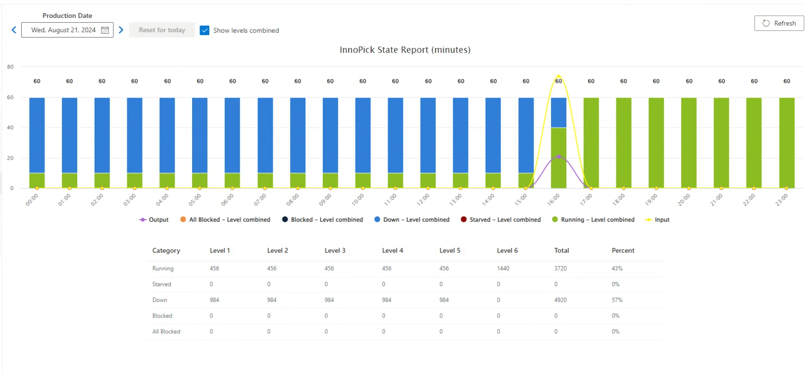

# InnoPick State

**[Home](../index.md) > [Reports](index.md) > InnoPick State**

## Overview

The InnoPick state report summarizes the input, output, and various states of the levels of InnoPick across a horizontal timescale. Note that the numbers are mostly minutes.

**Navigation:** [← Event Logs](event-logs.md) | [Faults History →](faults-history.md)
