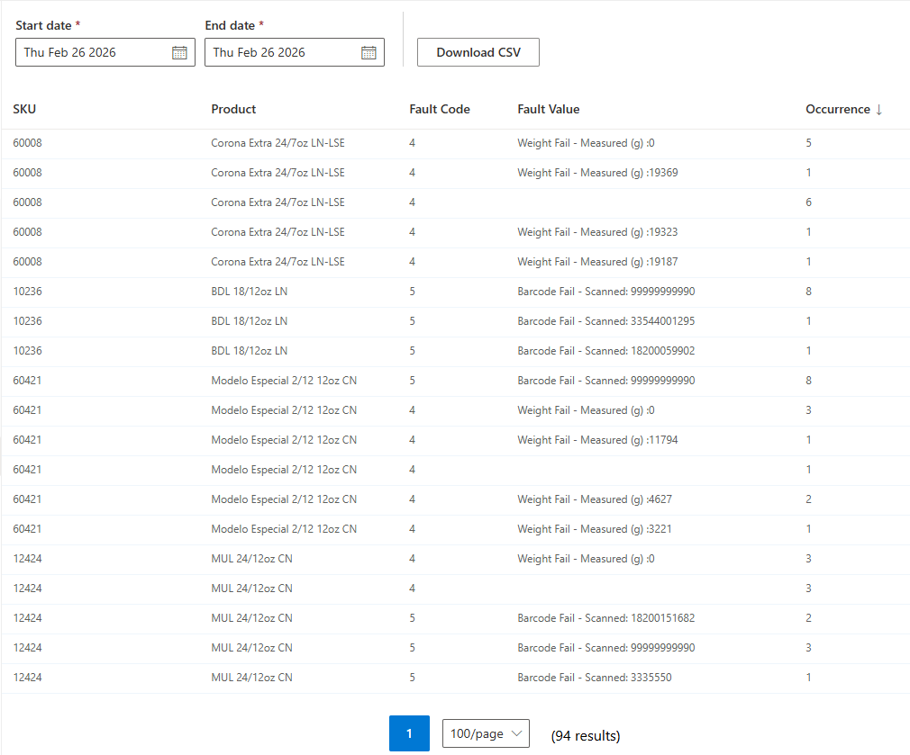

# Product QC Faults

**[Home](../index.md) > [Reports](index.md) > Product QC Faults**

## Overview

This report lists all the cases that were rejected at the QC stations, along with the relevant data that is available for them.

- The **Fault Code** refers to the cause of the case failure.
- The **Fault Value** is an automatically-generated message detailing what was measured or scanned.
- The report can be downloaded as a .csv file.

**Navigation:** [← Out of Stock](out-of-stock.md) | [Configuration →](../configuration/index.md)
