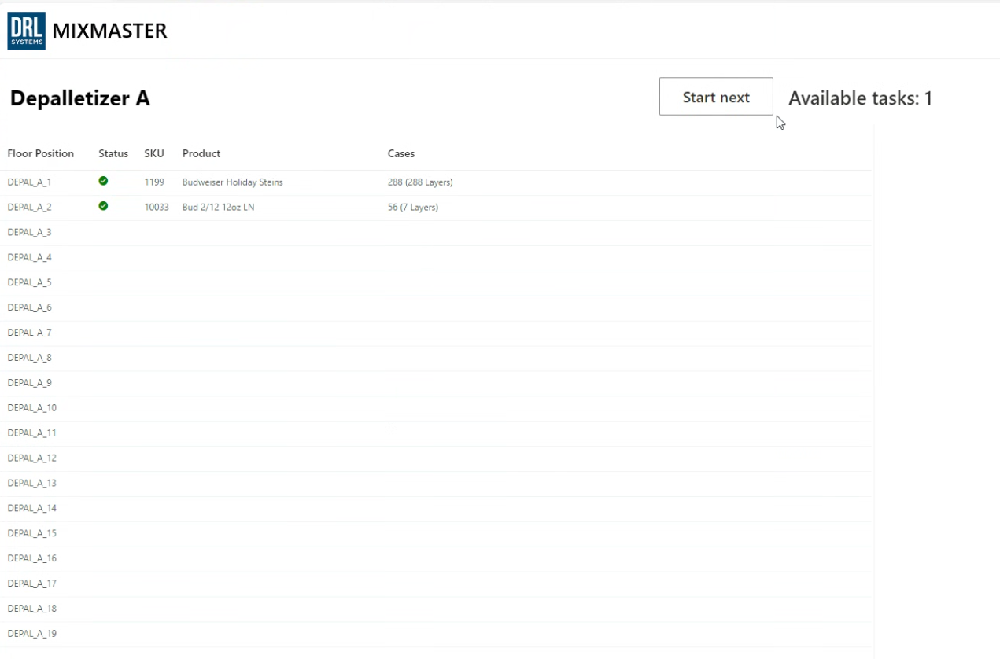
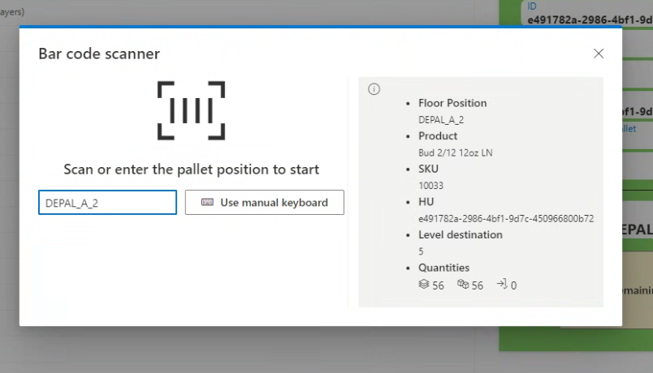
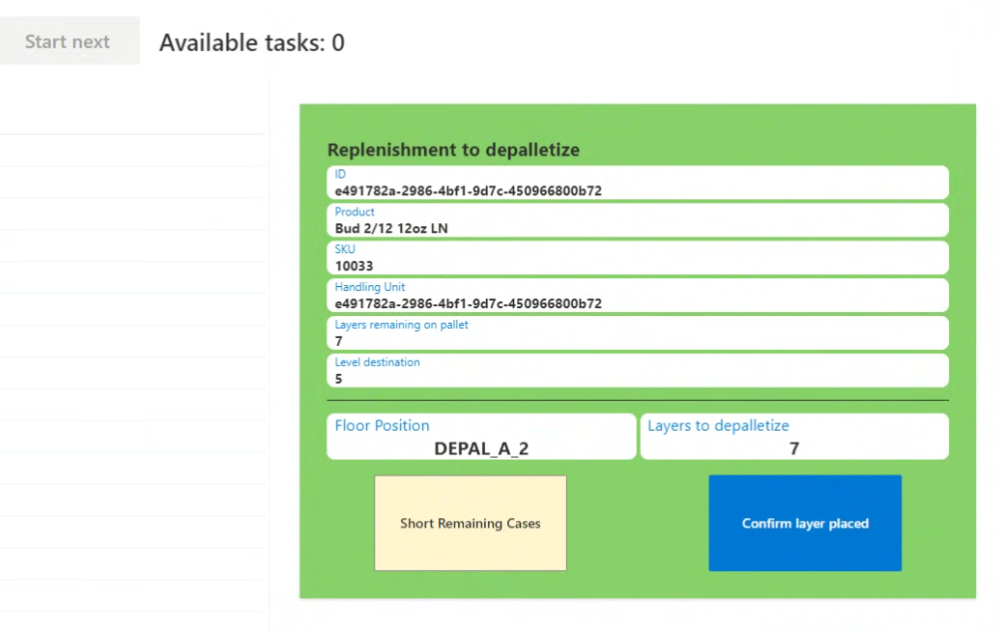
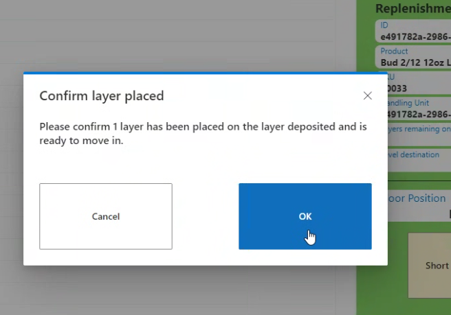

# Depalletizing Terminal

**[Home](../index.md) > [Terminals](index.md) > Depalletizing Terminal**

## Overview

When an operator is logged onto a Depalletizer Terminal, the page will display the various pallets (with their product details) that are currently in the Depal Floor Positions, as well as the number of **Available Tasks** that the operator can complete.

## Starting a Task

To confirm and begin a task, the operator has to click on the **Start Next** button on the top right of the screen. When a task is begun by the operator, a pop-up window appears in the center of the page and the operator must either scan the pallet position or enter it in manually, to confirm that the correct pallet is in view.

After the pallet position is confirmed, a display appears with the particulars of the depalletizing task.

## Confirming Layers

The operator then removes layers and presses the blue button, **Confirm layer placed**, after each layer deposit. This button will make another pop-up appear; the operator must press the **OK** button for the deposited layer of product to move downstream.

**Navigation:** [← Manual Induction](manual-induction.md) | [Home (Beginning of Manual)](../index.md)
